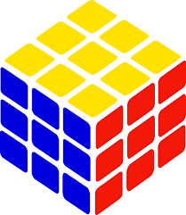
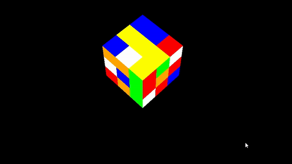
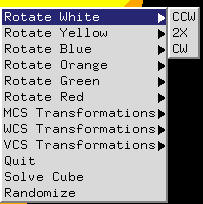

<!-- Template version 1.0
-->

<!-- PROJECT LOGO -->
 

  

  <h3 align="center">OpenGL Solvable Rubik's Cube</h3>

  

    CP-411 Fall 2022
     
    <a href="https://github.com/BrandonNNiles/OpenGL-Solvable-Rubiks-Cube"><strong>Project Repo</strong></a>
  

<!-- ABOUT THE PROJECT -->
## About The Project

This project is a project submission for CP-411 Fall 2022. The project aims to provide an interactive user-experience with an OpenGL-based Rubik's cube.

##### Noteable Features:
* Class-based implmentation
* Randomization algorithm
* Pseudo-solving algorithm
    * Stack implmentation to track moves
    * Calculating inverse of recorded moves

(<a href="#readme-top">back to top</a>)

### Built With

The following languages, tools, and frameworks were used to develop the project:

* C++
* OpenGL

(<a href="#readme-top">back to top</a>)

<!-- GETTING STARTED -->
## Getting Started

Follow the below steps to run the application.

### Requirements

- OpenGL

### Operation

a) Execute the file `Solveable Rubik's Cube.exe`.
or
b) Compile the contents of `/src/` with the compiler of your choosing.

(<a href="#readme-top">back to top</a>)

<!-- USAGE EXAMPLES -->
## Usage
Right click (RMB) to open the application's operation menu. From the menu, you can view several commands to can be executed. Clicking (LMB) a command will execute it. For panning/rotation of the environment, select the command, and then click and drag (LMB) to move the environment.

### Menu Commands

(<a href="#readme-top">back to top</a>)

## File Overview

### Simpleview Features
SimpleView is a project that was developed through-out the term of the class by the class with the instructions and guidance of professor HBF.

- `Camera`
- `Matrix`
- `Menu` - Modified to include various new features
- `Point`
- `Shape`
- `SimpleView`
- `Vector`
- `World`

### New Additions

- `Color` - Color object implementation
- `Node` - Node structure implementation for use with the stack
- `Rubiks` - Visual and structural design of the Rubik's Cube
- `stack` - Stack ADT implementation for solving

<!-- LICENSE -->
## License

Distributed under the MIT License. See `LICENSE.txt` for more information.

(<a href="#readme-top">back to top</a>)

<!-- CONTACT -->
## Contact

Brandon Niles - [LinkedIn](https://www.linkedin.com/in/brandonnniles/) - brandonniles00@gmail.com

(<a href="#readme-top">back to top</a>)

